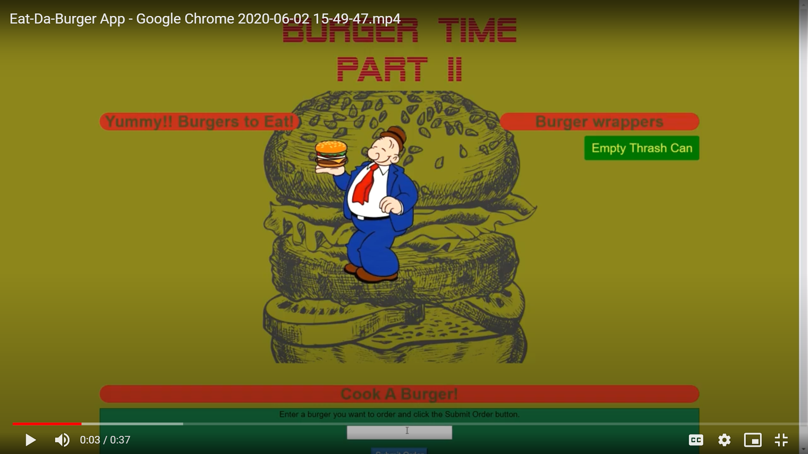

# Burger Time /n Part II
  BY Andy Geertz       
  express, express-handlebars, mysql, body-parser
   
  
  
  
  ## Purpose And Description Of Application
  MVC
Overview

As our full-stack web applications scale, we will need to address several issues related to that growth: organization of the codebase, on going development and maintenance, and continued collaboration. So far, our applications are easily managed as they only consist of a handful of files. We could limit the code base to these few files, but as we add functionality to our application, each of those files would grow in length to hundreds, if not thousands, of lines of code composed of unnecessarily complicated logic. Imagine how difficult it would be to resolve merge conflicts!

### methods and layout
Basic M.V.C (module,view,control) setup with express to manage view and database.
  ### [Launch  >](https://burger-time-2.herokuapp.com/)
  ## Installation 
1) Download files
2) Init npm and install modules (npm i)
3) run node server-express.js 
  
  ## Instructions For Use
load server

type in burger to cook, click to eat, click to empty thrash..
  
## Credit
Images sourced through https://www.pngfuel.com/
                        
  

  
  ## Future Development
  better design layout

  ## Contact Info
          Github id    Geertza
          Email        null
          If You have any questions fill free to respond to my Github account.
 
